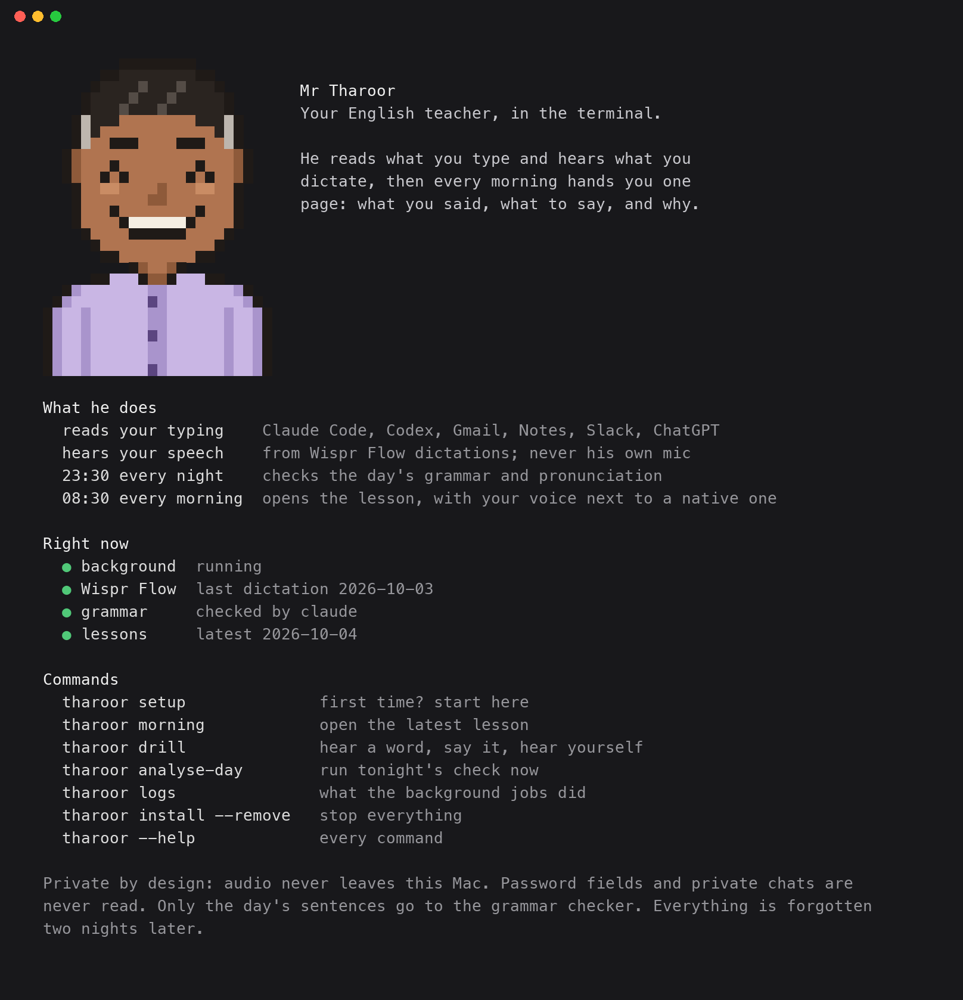

<div align="center">


# Mr Tharoor

**An English teacher who reads how you write and hears how you speak, then hands you a lesson every morning.**

</div>

---

He reads what you type, in Gmail, Slack, Notes, ChatGPT or Claude Code, and
what you dictate through Wispr Flow. He marks the grammar a teacher would mark,
hears the sounds you get wrong, and at 08:30 a page opens on your desk: what
you said, what to say instead, and the one word that tells you why.

macOS. He never opens your microphone, and your audio never leaves the laptop.

> **AGREEMENT**
> You said ~~"the people that is actually building"~~
> Say **"the people that are actually building"**
> *plural noun requires plural verb*
> &nbsp;&nbsp;&nbsp;&nbsp;"...find the people that is actually building and in consumer AI startup..."

## What you need

- **A Mac** and **Python 3.10 or newer**.
- **Claude Code or Codex**, installed and logged in. The grammar check runs
  through it once a night, on your own plan; nothing else to pay for.
- **Wispr Flow** (optional). It is where he hears you speak. Without it you
  get grammar lessons only, no pronunciation.

## Install

```bash
git clone https://github.com/ajmerabaibhav/Mr-Tharoor.git mr-tharoor
cd mr-tharoor && pip install -e . && tharoor setup
```

`tharoor setup` checks the machine, downloads the phoneme model (~1.3 GB,
once), asks two questions and installs three background jobs. Then type and
dictate normally. That is the whole interaction.

The two questions, both default **no**: may he read what you type into
Claude Code and Codex chats, and may he send the day's sentences to your
Claude Code or Codex CLI once a night for the grammar check (no means a few
local rules only, and nothing leaves the Mac). Run `tharoor setup` again to
change your answers.

To have him read what you type outside Claude Code and Codex, allow the Python
that `tharoor setup` names under **System Settings › Privacy & Security ›
Accessibility**, then run `tharoor install` once more.

## A day with him

1. **All day** you type and dictate as usual. He reads quietly in the background.
2. **23:30** he checks the day: grammar on what you wrote and said, and the
   sounds in your Wispr recordings.
3. **08:30** a page opens in your browser: each mistake, the correct version,
   one word on why, and your own voice next to a native speaker's.

Type `tharoor` on its own any time to see what he does and what is running:



## What he reads

| source | what it gives him |
|---|---|
| **Wispr Flow's database** | your dictation, in any app, with the audio already paired to the words you meant. Grammar *and* pronunciation. |
| **Claude Code and Codex** | what you typed, from their own history. Grammar only. Pastes, commands and tool output excluded. |
| **The text box you are typing in** | Mail, Slack, ChatGPT, Notes, a browser. Grammar only. Read through Accessibility like a screen reader, never keystrokes. Never reads password fields, single-line boxes (URL bars, search, logins), password managers, terminals or private chats, and nothing at all while macOS Secure Input is on. Pastes are dropped; emails, links and long numbers are scrubbed before they are saved. Off until you allow it under Accessibility (see Install). |

## How it works, for the curious

```
the sounds you MADE   wav2vec2-espeak, on your machine, no language model
the words you MEANT   Wispr's own text
        ↓
pool by SOUND across every word carrying it, weighted by audio quality,
report only when the lower bound of the credible interval clears the floor

the grammar            one batched call a night to the CLI already installed here:
                       Claude Code (Haiku 4.5), or Codex (gpt-6-luna) if that is what you have
        ↓
every correction must quote a span that is really in your transcript, or it
is dropped. Nothing else stands between you and an invented mistake.
```

## Commands

| | |
|---|---|
| `tharoor` | who he is, what he does, and what is running right now |
| `tharoor listen` | the background job: reads your typing. Never opens the microphone |
| `tharoor analyse-day` | run tonight's job now |
| `tharoor morning` | open the latest lesson |
| `tharoor check` | judge his findings, so accuracy becomes a number |
| `tharoor drill` | hear it, say it, hear it again |
| `tharoor logs` | what the scheduled jobs actually did |
| `tharoor install --status` | are the three agents really running |
| `tharoor install --remove` | stop all of it |

## What he will not claim

- **He never opens the microphone, so meetings are never recorded.** Speech
  comes only from Wispr Flow, when you choose to dictate. No dictation, no
  pronunciation lesson. (Measured: his own mic was 3.1 dB on an ordinary day
  against 24.0 dB through Wispr, and in a meeting it scored the other person
  as you.)
- **Pronunciation accuracy on your voice is unmeasured.** `tharoor check` is
  the only thing that turns it into a number. Nobody has run it yet.
- **Text leaves the machine once a night** for the grammar call.
  It uses the Claude Code CLI, or OpenAI's Codex CLI if that is what you have
  (`MR_THAROOR_LLM=codex` to choose it when both are installed).
  `MR_THAROOR_NO_LLM=1` turns that off and falls back to local rules.
  To keep that text out of model training, on a personal plan turn off "Help improve Claude" at
  claude.ai/settings/data-privacy-controls, or "Improve the model for
  everyone" in ChatGPT → Settings → Data controls (it covers Codex too).
  Work, team and API accounts are not trained on by default.

## Privacy

Audio never leaves the laptop. Everything stored about a day (recordings,
clips, the report, your sentences, the tallies) deletes itself two nights
later: Monday's data is gone on Wednesday night. He never opens the
microphone. Typed text is read only from multi-line text boxes, never from
password fields, password managers, terminals or private chats, and emails,
links and long numbers are scrubbed before it is saved. `data/`, `cache/`,
`reports/` and `logs/` are gitignored; this repo contains no recordings and
no one's sentences but the example above.

## Tests

```bash
pip install -e '.[dev]' && python3 -m pytest tests -q
```

---

> **A tribute, not an association.** The name and manner are an affectionate
> nod to Dr Shashi Tharoor. This project is **not affiliated with, endorsed by,
> or connected to him in any way**, the character is a fictional mascot, and
> the drawing is nobody's likeness. If any objection is ever raised, the name
> will be changed without argument.

What changed and what was measured: [CHANGELOG.md](CHANGELOG.md).
What is still broken: [TODOS.md](TODOS.md). MIT.
